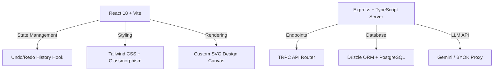

# 📇 GlassCard AI — Ultra-Premium Digital Visiting Card Design Studio

[](https://digicard-theta.vercel.app)
[](https://vite.dev)
[](https://www.typescriptlang.org)
[](https://tailwindcss.com)

GlassCard AI is a state-of-the-art, open-source **Digital Visiting Card Builder & Design Studio** that brings Canva-like absolute layer control and Figma-like precision to web-based digital cards. Built with a stunning **glassmorphism aesthetic**, it enables designers, teams, and individuals to create, customize, and batch-generate premium interactive cards.

---

## 🎨 Interactive Live Design Studio
Check out the live studio at [digicard-theta.vercel.app](https://digicard-theta.vercel.app).

---

## 🚀 Core Features

### 📐 1. Canvas-Style Design Engine
- **Independent Layers Control**: Select, move, scale, or toggle any layer on the canvas.
- **Layers Sidebar Panel**: A dedicated layers list sidebar matching professional design tools, showing:
  - **Show/Hide Controls**: Toggle visibility per layer reactively.
  - **Lock/Unlock Controls**: Freeze elements on the canvas to prevent accidental dragging.
- **Properties Inspector**: Detailed controllers to customize text font sizes, image scaling, and individual divider line properties (thickness, color picker, opacity, and rotation).
- **Free-Flow Dragging**: Smooth dragging physics with no snapping constraints.

### ⏱️ 2. Design History & Keyboard Shortcuts
- **Undo / Redo Stack**: Complete state manager tracking card data, layer offsets, and custom text boxes.
- **Debounced Action Commits**: Debounces text inputs and mouse releases to record clean history checkpoints.
- **Keyboard Shortcuts**:
  - `Ctrl + Z` / `Cmd + Z` ➔ **Undo**
  - `Ctrl + Y` / `Cmd + Y` ➔ **Redo**
  - `Ctrl + Shift + Z` / `Cmd + Shift + Z` ➔ **Redo (macOS/Figma-native)**

### 🧩 3. Multiple Premium Layout Compositions
- **Vertical Templates (with/without Photo)**: Clean 3:4 aspect ratio optimized for mobile screens.
- **Horizontal Templates (with/without Photo)**: Tidy 16:9 aspect ratio optimized for desktop browsers.
- **Adaptive Spacing**: Intelligent vertical grids and columns that automatically wrap text, keeping card rhythm perfect without overlap.

### 🤖 4. BYOK (Bring Your Own Key) AI Assistant
- Support for API key integrations (Groq, OpenRouter, Cerebras) to generate custom taglines, designations, and professional bios.
- Safe backend environment variables proxy via Vercel Serverless Functions, keeping your API keys hidden from client-side network inspectors.

### 📥 5. Enterprise Batch Generator
- **CSV & Excel Bulk Upload**: Load list files to batch-generate cards for up to 10 candidates simultaneously.
- **ZIP Exporter**: Instantly package generated cards as high-resolution PNGs/PDFs.

---

## 🛠️ Technology Stack



- **Frontend**: React 18, Vite, Tailwind CSS, Lucide React icons, QRCodeSVG.
- **Backend**: Node.js, Express, tRPC.
- **Database & Storage**: Drizzle ORM, PostgreSQL, AWS S3 / Cloudflare R2 object storage.
- **Exporting Engine**: html2canvas, jsPDF.

---

## 🔧 Getting Started

### 📦 Prerequisites
- **Node.js** v18+
- **pnpm** (Recommended) or **npm**

### 📥 Installation
1. Clone the repository:
   ```bash
   git clone https://github.com/bobtech-IIT/digicard.git
   cd digicard
   ```
2. Install dependencies:
   ```bash
   pnpm install
   ```

### 💻 Development Server
Start the client and dev API router concurrently:
```bash
pnpm dev
```
The client app runs at `http://localhost:5173`.

### 🏗️ Production Build
Compile client bundles and server entrypoint:
```bash
pnpm build
pnpm start
```

---

## 🔒 Security & API Integration
To prevent leaking sensitive LLM provider keys and database URLs, all API integrations are routed through **Vercel Serverless Functions** (`/api/*`). 

Ensure you configure the following variables in your Vercel Project Settings:
- `DATABASE_URL`: PostgreSQL connection string.
- `JWT_SECRET`: Signature key for login sessions.
- `BUILT_IN_FORGE_API_KEY`: API key for built-in LLM assistance.

---

## 📜 License
Licensed under the [MIT License](LICENSE). Made with ❤️ by the GlassCard AI team.
